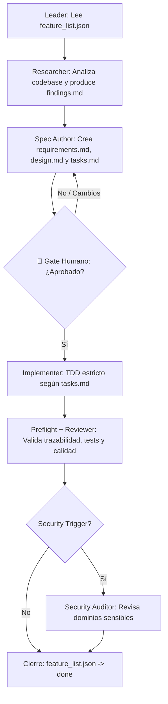

# 🚀 Stack-Agents — Spec-Driven Development (SDD) Workflow

Plantilla reutilizable y clonable para integrar la metodología **Spec-Driven Development (SDD)** con subagentes de IA especializados en cualquier proyecto de software.

Soporta múltiples entornos y CLI de Inteligencia Artificial:
- **Claude Code** (`.claude/`)
- **OpenCode Interpreter** (`.opencode/`)
- **Gemini / Antigravity CLI** (`.gemini/`)

---

## 📐 ¿Qué es Spec-Driven Development (SDD)?

El flujo SDD separa estrictamente el diseño de la implementación, evitando que los modelos de IA escriban código a ciegas. Un agente orquestador (`/leader`) coordina subagentes especializados que investigan, redactan especificaciones técnicas, esperan la **aprobación humana obligatoria**, implementan código bajo **TDD estricto** y auditan la calidad antes de cerrar una tarea.

---

## 📁 Estructura del Repositorio

```text
Stack-Agents/
├── .claude/                # Configuración, reglas y skills para Claude Code
│   ├── CLAUDE.md
│   └── skills/
├── .opencode/              # Configuración y subagentes para OpenCode Interpreter
│   ├── AGENTS.md
│   ├── agents/             # Agentes (.md) con YAML frontmatter
│   └── skills/
├── .gemini/                # Configuración y skills para Antigravity / Gemini CLI
│   ├── GEMINI.md
│   └── skills/
├── shared/                 # Plantillas base copiadas por los instaladores
│   ├── AGENTS.md           # Template AGENTS.md para la raíz del proyecto destino
│   ├── feature_list.json   # Template vacío de backlog
│   └── progress/           # Template de estado de sesión
│       └── current.template.md
├── init-sdd.ps1            # Instalador Windows PowerShell
├── init-sdd.sh             # Instalador Linux / macOS / Git Bash
└── README.md
```

---

## ⚡ Instalación Rápida en un Proyecto

Podés clonar este repositorio e inicializar la estructura SDD en cualquier proyecto existente o nuevo.

### Windows (PowerShell)

```powershell
# Inicializar en el directorio actual (instala todas las IAs por defecto)
.\init-sdd.ps1

# O especificar un proyecto destino y proveedor específico
.\init-sdd.ps1 -TargetDir "D:\Proyectos\MiApp" -Provider claude
```

### Linux / macOS / Git Bash

```bash
# Otorgar permisos de ejecución
chmod +x ./init-sdd.sh

# Inicializar en el directorio actual
./init-sdd.sh

# O especificar un proyecto destino y proveedor
./init-sdd.sh --target /ruta/a/proyecto --provider all
```

### Parámetros de `init-sdd`

| Parámetro | Alias | Descripción | Valores válidos | Defecto |
|---|---|---|---|---|
| `-TargetDir` | `-t, --target` | Directorio donde instalar SDD | Ruta absoluta o relativa | `.` (actual) |
| `-Provider` | `-p, --provider` | Proveedor(es) de IA a configurar | `all`, `claude`, `opencode`, `gemini` | `all` |

Al finalizar la ejecución, el script **inspecciona y verifica** que todos los archivos requeridos se hayan instalado correctamente.

---

## 🔄 Flujo del Pipeline SDD

### 1. Modos de Trabajo

| Modo | Cuándo usarlo | Fases que ejecuta |
|---|---|---|
| **Quick** | Correcciones rápidas, hotfixes, tareas pequeñas | Implementer → Reviewer |
| **Full** | Features medianas o grandes, refactors | Researcher → Spec Author → **[GATE HUMANO]** → Implementer → Reviewer → Security Auditor |

### 2. Pipeline Completo (Modo Full)



---

## 🤖 Subagentes Especializados

| Subagente | Skill | Responsabilidad principal | Entregable (Archivo) |
|---|---|---|---|
| **`leader`** | - | Orquestador general en modo conciso. Rol por defecto al iniciar sesión, no es un comando invocable. | `progress/current.md` |
| **`discovery`** | `discovery` | Entrevista inicial para proyectos greenfield. | `research/project-brief.md` |
| **`architecture_builder`** | `architecture-builder` | Genera documentación de arquitectura global y mapeo de seguridad. | `architecture/architecture.md` |
| **`researcher`** | `researcher` | Explora el codebase y busca patrones o dependencias antes de redactar specs. | `research/<feature>/<feature>-findings.md` |
| **`spec_author`** | `spec-author` | Escribe especificaciones técnicas detalladas y plan de tareas. | `specs/<feature>/requirements.md`, `design.md`, `tasks.md` |
| **`implementer`** | `implementer` | Escribe tests y código siguiendo **TDD estricto**. Emite Change Requests (CR) si hay desvíos. | Código de la app y `changes/<feature>/<área>/CR-NNN.md` |
| **`reviewer`** | `reviewer` | Revisa calidad, trazabilidad y cumplimiento en dos pasadas. | `reports/<feature>-review.md` |
| **`security_auditor`** | `security-auditor` | Auditoría de seguridad en cambios que tocan paths sensibles. | `reports/<feature>-security-audit.md` |
| **`diagnose`** | `diagnose` | Debugging estructurado mediante hipótesis falsables y reproductor de tests. | `reports/diagnose-<bug>.md` |
| **`scm`** | `scm` | Gestión de branches, commits convencionales y worktrees. | Commits / Git Worktrees |

---

## 🛡️ Regla Anti-Teléfono-Descompuesto

Para evitar alucinaciones y pérdida de contexto entre invocaciones de IA:

> **Todos los subagentes deben escribir sus entregables en disco** (en `specs/`, `research/`, `reports/`, `changes/`, `architecture/`) y responder únicamente con la **ruta de los archivos generados**, nunca con resúmenes largos por chat.
