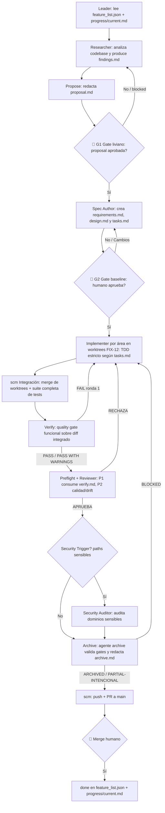

# 🚀 Stack-Agents — Spec-Driven Development (SDD) Workflow

Plantilla reutilizable y clonable para integrar la metodología **Spec-Driven Development (SDD)** con subagentes de IA especializados en cualquier proyecto de software.

El flujo SDD separa estrictamente el diseño de la implementación, evitando que los modelos de IA escriban código a ciegas. Un agente orquestador (`leader`) coordina subagentes especializados que investigan, redactan especificaciones técnicas, esperan la **aprobación humana obligatoria**, implementan código bajo **TDD estricto** y auditan la calidad antes de cerrar una tarea.

## 1. Qué es + providers soportados

**Stack-Agents** es una plantilla distribuible (no una aplicación): instala la estructura de trabajo SDD — agentes, skills, reglas, backlog y directorios de entregables — en cualquier proyecto existente o nuevo mediante los instaladores `init-sdd.ps1` / `init-sdd.sh`.

Soporta tres providers de IA (el repo sigue soportando los tres; el detalle de las fases nuevas Propose / Verify / Archive / Onboard y worktrees FIX-12 aplica **solo a opencode**):

- **Claude Code** (`.claude/`) — agentes, comandos y skills para Claude Code.
- **OpenCode Interpreter** (`.opencode/`) — configuración, subagentes (`.opencode/agents/`) y skills (`.opencode/skills/`). Es el provider con el pipeline vigente más completo: Propose + gate liviano, Verify, Archive, Onboard y worktrees FIX-12.
- **Gemini / Antigravity CLI** (`.gemini/`) — configuración y skills equivalentes (`GEMINI.md`, delegación vía `define_subagent` / `invoke_subagent`).

> Nota de alcance: este repositorio no contiene código de producto, API, base de datos, autenticación ni infraestructura de despliegue. La documentación de arquitectura vigente vive en `architecture/architecture.md`. No se promete ningún CLI, binario ni servidor MCP: el "producto" son los instaladores, las plantillas de `shared/` y los dotfolders de provider.

---

## 2. Estructura del repo

```text
Stack-Agents/
├── .claude/                  # Configuración, reglas, agentes, comandos y skills para Claude Code
├── .opencode/                # Configuración y subagentes para OpenCode Interpreter
│   ├── AGENTS.md             # Pipeline vigente (Propose+gate, Verify, Archive, Onboard, worktrees FIX-12, Quick vs Full)
│   ├── agents/               # 14 agentes (.md con YAML frontmatter): leader, discovery,
│   │                         # architecture-builder, researcher, propose, spec-author,
│   │                         # implementer, verify, reviewer, security-auditor,
│   │                         # archive, diagnose, scm, onboard
│   ├── skills/               # Guías de cada skill (implementer, reviewer, scm, propose, verify, archive, onboard, …)
│   └── opencode.json         # Selecciona `leader` como agente predeterminado
├── .gemini/                  # Configuración y skills para Antigravity / Gemini CLI (GEMINI.md)
├── shared/                   # Plantillas base copiadas por los instaladores
│   ├── AGENTS.md             # Template AGENTS.md para la raíz del proyecto destino
│   ├── feature_list.json     # Template vacío de backlog
│   └── progress/             # Template de estado de sesión
│       └── current.template.md
├── architecture/             # Documentación de arquitectura generada
│   ├── architecture.md       # Alcance: plantilla (instaladores, providers, mapa de triggers)
│   └── decisions/            # ADRs (p. ej. ADR-001.md)
├── research/                 # Hallazgos del flujo SDD: research/<feature>/<feature>-findings.md + proposal.md
├── specs/                    # Baselines por feature: specs/<feature>/{requirements,design,tasks}.md
├── reports/                  # Evidencia de gates: *-verify.md, *-review.md, *-security*.md, *-archive.md, onboard-*.md
├── changes/                  # Change Requests: changes/<feature>/<área>/CR-NNN.md
├── scripts/                  # Configuración operacional (p. ej. security-trigger.config.json)
├── tests/                    # Suites de validación por feature (p. ej. template-hardening, sdd-onboard-flow)
├── feature_list.json         # Backlog real del stack (ver §9 Estado del backlog)
├── init-sdd.ps1              # Instalador Windows PowerShell
├── init-sdd.sh               # Instalador Linux / macOS / Git Bash
└── README.md                 # Este archivo
```

**Directorios de trabajo SDD** (creados por los instaladores en el destino si faltan): `architecture/decisions`, `specs`, `research`, `changes`, `progress`, `reports`, `scripts`.

**Worktrees `wt-*`**: cuando hay paralelismo por área (FIX-12, solo opencode), `scm` crea un worktree por área **fuera del working directory principal** con el naming `wt-<feature-id>-<área>` (p. ej. `wt-sdd-onboard-flow-plantilla`). Son directorios de trabajo temporales de git, no se commitean al repo.

---

## 3. Instalación rápida

Podés clonar este repositorio e inicializar la estructura SDD en cualquier proyecto existente o nuevo.

### Windows (PowerShell)

```powershell
# Inicializar en el directorio actual (instala todos los providers por defecto)
.\init-sdd.ps1

# O especificar un proyecto destino y un provider específico
.\init-sdd.ps1 -TargetDir "D:\Proyectos\MiApp" -Provider claude
```

### Linux / macOS / Git Bash

```bash
# Otorgar permisos de ejecución
chmod +x ./init-sdd.sh

# Inicializar en el directorio actual
./init-sdd.sh

# O especificar un proyecto destino y provider
./init-sdd.sh --target /ruta/a/proyecto --provider all
```

### Parámetros de `init-sdd`

| Parámetro | Alias | Descripción | Valores válidos | Defecto |
|---|---|---|---|---|
| `-TargetDir` | `-t, --target` | Directorio donde instalar SDD | Ruta absoluta o relativa | `.` (actual) |
| `-Provider` | `-p, --provider` | Proveedor(es) de IA a configurar | `all`, `claude`, `opencode`, `gemini` | `all` |

Qué hace el instalador (7 etapas, equivalentes en PowerShell y Bash): resuelve destino y provider → crea directorios SDD → copia plantillas de `shared/` si faltan → copia el dotfolder del provider seleccionado → crea `feature_list.json` si falta → crea o anexa reglas SDD a `.gitignore` → crea `AGENTS.md` si falta → verifica presencia de archivos clave. Al finalizar, el script **inspecciona y verifica** que todos los archivos requeridos se hayan instalado correctamente.

---

## 4. Pipeline

### 4.1. Modos Quick vs Full

| Modo | Cuándo usarlo | Fases que ejecuta |
|---|---|---|
| **Quick** | Correcciones rápidas, hotfixes, tareas pequeñas (p. ej. FIX-12, README) | Implementer (TDD) → Reviewer. **Exento de Propose** (no produce ni exige `proposal.md`) y **sin Verify**. |
| **Full** | Features medianas o grandes, refactors, componentes nuevos | Researcher → [Propose + gate liviano] → Spec Author → **[Gate baseline]** → Implementer(s en paralelo por área) → Integración (scm) → Verify (máx. 2 rondas) → Preflight + Reviewer (máx. 2 vueltas) → Security Auditor (condicional) → Archive (agente `archive`) → PR + `done`. |

El modo se elige explícitamente al arrancar cada feature (campo `mode` en `feature_list.json`); el sistema nunca decide el modo por sí solo. El recorrido **Onboard** no es un tercer modo: es el walkthrough guiado del modo Full (ver §7).

### 4.2. Diagrama del pipeline Full (vigente, solo opencode en el detalle de fases nuevas)



### 4.3. Tabla de gates

| Gate | Dónde | Qué aprueba el humano | Si se rechaza |
|---|---|---|---|
| **G1 — proposal** (liviano, solo Full solo-opencode) | Tras `research/<feature>/proposal.md` del agente `propose` | Intent / scope / approach antes de invertir en specs | Vuelve a Researcher (re-exploración). Nunca se avanza a `specs/<feature>/` sin proposal aprobada. |
| **G2 — baseline** (bloqueante, todos los Full) | Tras `specs/<feature>/{requirements,design,tasks}.md` del Spec Author | La baseline completa (requisitos, diseño, plan de tareas versionado v1) | Vuelve al Spec Author; el versionado de baseline (v1 → v2) lo emite solo el Spec Author ante CRs adaptativos/perfectivos/preventivos aprobados. |
| **Merge humano** (bloqueante) | Tras `reports/<feature>-archive.md` con veredicto `ARCHIVED` o `PARTIAL-INTENCIONAL` | El merge del PR a `main` (el agente `scm` abre el PR pero nunca mergea) | La rama queda abierta/local. El Leader marca `done` y actualiza `progress/current.md` solo tras acta + merge humano. |

Presupuestos anti-loop (solo Full solo-opencode): Verify máx. 2 rondas (`verify_round: 1 | 2`, independiente de `reviewer_round` y del contador de CRs); Reviewer máx. 2 vueltas (Preflight + P1/P2). Tras agotar rondas sin converger, el Leader escala a humano. Verify nunca edita código ni inicia loops por sí mismo; una contradicción irresoluble spec-vs-design-vs-diff es `FAIL` + escalación, no reintento; una ronda Verify → Verify sin cambio de diff (mismo hash) está prohibida.

---

## 5. Subagentes (los 14)

Definidos en `.opencode/agents/` (guías en `.opencode/skills/`; equivalentes en `.claude/` y `.gemini/` según provider). El Leader (`leader`) nunca implementa código directamente, nunca salta gates y nunca marca `done` manualmente.

| Subagente | Skill | Responsabilidad principal | Entregable |
|---|---|---|---|
| **`leader`** | `leader` | Orquestador general en modo conciso. Rol por defecto al iniciar sesión, no es un comando invocable. Lee `feature_list.json` y `progress/current.md`, elige delegaciones, presenta gates al humano. | `progress/current.md` (solo tras acta + merge humano) |
| **`discovery`** | `discovery` | Entrevista inicial para proyectos **greenfield** (sin código). | `research/project-brief.md` |
| **`architecture-builder`** | `architecture-builder` | Genera/actualiza la documentación de arquitectura global y el mapa de triggers de seguridad. | `architecture/architecture.md`, `scripts/security-trigger.config.json` |
| **`researcher`** | `researcher` | Explora el codebase y busca patrones, dependencias o riesgos antes de especificar. | `research/<feature>/<feature>-findings.md` |
| **`propose`** | `propose` | Propuesta concisa de intent/scope/approach + gate humano pre-spec. Obligatoria en Full, exenta en Quick. (Solo opencode.) | `research/<feature>/proposal.md` |
| **`spec-author`** | `spec-author` | Redacta la baseline versionada. No inicia sin proposal aprobada; rechaza proposals malformadas. Único que versiona la baseline (v1 → v2). | `specs/<feature>/requirements.md`, `design.md`, `tasks.md` |
| **`implementer`** | `implementer` | Escribe tests y código siguiendo **TDD estricto** (RED → GREEN → REFACTOR) sobre las tasks de **su área**. Emite Change Requests si hay desvíos. Nunca valida su propio código, nunca toca specs, nunca commitea. | Código + tests; `changes/<feature>/<área>/CR-NNN.md` |
| **`scm`** | `scm` | Gestión de branches, commits convencionales, worktrees FIX-12, integración de áreas y apertura de PRs. No ejecuta Archive, no marca `done`. | Commits / worktrees `wt-<feature>-<área>` / Pull Request |
| **`verify`** | `verify` | Quality gate funcional sobre el diff **integrado** post-scm y pre-Reviewer (solo Full). No edita código. Veredicto `PASS` / `PASS WITH WARNINGS` / `FAIL`. (Solo opencode.) | `reports/<feature>-verify.md` |
| **`reviewer`** | `reviewer` | Dos pasadas: P1 negocio/tests (consume `verify.md` como evidencia autoritativa, no re-decide sin motivo concreto) y P2 calidad/drift/ADRs con veredicto final `APRUEBA` / `RECHAZA`. | `reports/<feature>-review.md` (+ `*-preflight.md` si aplica) |
| **`security-auditor`** | `security-auditor` | Auditoría condicional si el diff toca paths de `security-trigger.config.json`. (Solo opencode en el detalle del trigger.) | `reports/<feature>-security*.md` |
| **`archive`** | `archive` | Cierre de ciclo (solo Full solo-opencode): valida gates bloqueantes (Verify PASS, Review APRUEBA, cero CRITICAL, tasks 100 %, CRs aprobados) y redacta el acta. No commitea, no pushea, no abre PR, no mergea ni marca `done`. | `reports/<feature>-archive.md` (`ARCHIVED` / `BLOCKED` / `PARTIAL-INTENCIONAL`) |
| **`diagnose`** | `diagnose` | Debugging estructurado fuera del flujo de features: hipótesis falsables, reproductor y test de regresión. | `reports/diagnose-<bug>.md` |
| **`onboard`** | `onboard` | Narrador del recorrido Onboard (walkthrough guiado del modo Full). Solo `read *`; narra (1–3 oraciones por fase) y delega cada fase al agente real, no escribe. (Solo opencode.) | Narración + `reports/onboard-*.md` (summary con template `## Onboarding Complete!`) |

Delimitación Verify vs Reviewer: Verify es autoridad de conformidad funcional (tasks completas, RF/escenario → covering test pasado, coherencia design); Reviewer P1 la consume sin re-decidir salvo contradicción concreta; P2 (CRAP/mutación/naming/duplicación, ADRs/drift `architecture_drift`, veredicto final) es exclusivo del Reviewer; seguridad/RLS/secretos son exclusivos del Security Auditor.

---

## 6. Paralelismo por área + worktrees FIX-12 (solo opencode)

Cuando `specs/<feature>/tasks.md` trae tasks etiquetadas con distintas `área`, el Leader paraleliza (FIX-12):

1. Agrupa las tasks pendientes por campo `área`.
2. Si hay **1 sola área** → un único Implementer secuencial (comportamiento clásico, sin worktrees).
3. Si hay **2+ áreas** → delega a `scm` la creación de **un worktree por área** (`wt-<feature-id>-<área>`), **ANTES de lanzar ningún Implementer**.
4. Lanza **un Implementer por área, en paralelo**, pasándole a cada uno (a) SOLO las tasks de su área y (b) la ruta absoluta de su worktree. Cada Implementer trabaja exclusivamente ahí, nunca en el working directory principal ni en tasks de otras áreas. Si necesita algo de otra área, lo documenta como bloqueo en un CR, no lo implementa por su cuenta.
5. Espera a que todos reporten (rutas de sus `changes/` / reportes).
6. Delega a `scm` la **Integración**: merge de los worktrees a la rama `feature/<feature-id>` + suite completa de tests recién ahí.
7. Recién tras la integración exitosa invoca a `verify` y luego al Reviewer, **sobre el diff ya integrado** — Verify y Reviewer nunca ven worktrees sueltos.

Fallback: sin etiquetas de área (o todas iguales), se usa un solo Implementer secuencial sin worktrees ni paso de integración.

---

## 7. Onboard guiado (solo opencode)

El **Onboard** NO es un modo nuevo ni altera el pipeline: es el **recorrido guiado e interactivo del modo Full sobre un codebase real (brownfield)**, narrado por el subagente `onboard` según el guion ejecutable de la skill `onboard`. Sirve para conocer el stack "haciendo": se ejecuta una mejora demo pequeña y segura (`onboard-demo-*`) atravesando todas las fases con artefactos reales por ruta.

**Cuándo usarlo vs Discovery:**

| Situación | Usar |
|---|---|
| Proyecto **greenfield** (sin código): hay que decidir qué construir | **Discovery** → entrevista → `research/project-brief.md` |
| Proyecto **brownfield** (con código + `architecture/architecture.md`): hay que aprender el flujo trabajando | **Onboard** → walkthrough haciendo → demo `onboard-demo-*` + summary |

Si no hay código fuente ni `architecture/architecture.md`, se deriva a Discovery y no se fuerza el Onboard. El Leader invoca al narrador `onboard` para narrar y delega cada fase al agente real (`researcher` → `spec-author` → `implementer` → `reviewer` → `scm` / `security-auditor` según aplique).

Reglas duras del Onboard:

- **Rama `feature/onboard-*` obligatoria**: toda mutación de la demo ocurre ahí (worktree `wt-onboard-*` si aplica), creada **antes** de cualquier escritura en `src/`/`tests/`. PROHIBIDO trabajar sobre `main` o sobre ramas de features ajenas.
- **Sin merge automático a `main`**: el PR queda abierto o la rama queda local para revisión.
- **Sin `done`**: la demo nunca se marca `done` en `feature_list.json` ni en `progress/current.md`, y **no se registra** en `feature_list.json` (el tracking vive solo en su rama/carpeta: `specs/onboard-demo-*/`, `research/onboard-demo-*/`, `reports/onboard-demo-*`).
- **Persistencia del summary**: el cierre usa el template `## Onboarding Complete!` en chat Y se guarda en `reports/onboard-*.md` para trazabilidad y relectura.

---

## 8. Regla anti-teléfono-descompuesto

Para evitar alucinaciones y pérdida de contexto entre invocaciones de IA:

> **Todos los subagentes deben escribir sus entregables en disco** (en `specs/`, `research/`, `reports/`, `changes/`, `architecture/`) **y responder únicamente con la ruta de los archivos generados**, nunca con resúmenes largos por chat.

El Leader encadena fases pasándose rutas, no resúmenes: cada agente downstream recibe las rutas de los artefactos aprobados (proposal aprobada → Spec Author; baseline aprobada → Implementers; diff integrado + baseline + `verify.md` → Reviewer; etc.).

---

## 9. Estado del backlog

Fuente de verdad: `feature_list.json` en la raíz (campos `id`, `title`, `mode`, `status`: `pending` → `in_progress` → `done`; solo se marca `done` tras acta de Archive + merge humano del PR).

| Feature | Modo | Estado | Qué es |
|---|---|---|---|
| `template-hardening` | full | **done** | Endurecer plantilla SDD: validación automatizada, exclusión node_modules, paridad PowerShell/Bash, trazabilidad y contrato auditoría. |
| `fix-12-worktrees-before-implementers` | quick | **done** | FIX-12: crear worktrees por área ANTES de lanzar implementers en paralelo (solo opencode). |
| `sdd-propose-phase` | full | **done** | Fase SDD Propose (solo opencode): propuesta intent/scope/approach con gate humano antes de spec. |
| `sdd-verify-phase` | full | **done** | Fase SDD Verify independiente (solo opencode): verificación contra spec/design/tasks separada de Reviewer. |
| `sdd-archive-phase` | full | **done** | Fase SDD Archive (solo opencode): merge delta-specs y cierre de ciclo. |
| `sdd-onboard-flow` | full | **done** | Flujo SDD Onboard guiado (solo opencode): walkthrough end-to-end sobre codebase real. |
| `readme-sdd-completo` | quick | in_progress | Este README completo: pipeline con Propose/Verify/Archive/Onboard + worktrees FIX-12 (solo opencode). |

O sea: 6 features `done` (`template-hardening`, FIX-12 y las 4 fases SDD) y 1 `in_progress` (este README). Las evidencias de cada fase viven en `research/<feature>/`, `specs/<feature>/` y `reports/<feature>-{verify,review,security,archive}.md`.

**Pull Requests:** cada cierre de feature se publica como PR a `main` mediante `scm` (push + apertura de PR citando `verify.md` junto a review/security/archive) y solo un humano lo mergea. Los PRs del stack viven en la pestaña *Pull requests* del repo (`https://github.com/diegoolherry/Stack-Agents/pulls`); este README (`readme-sdd-completo`) también se cierra vía PR + `done` tras merge.
