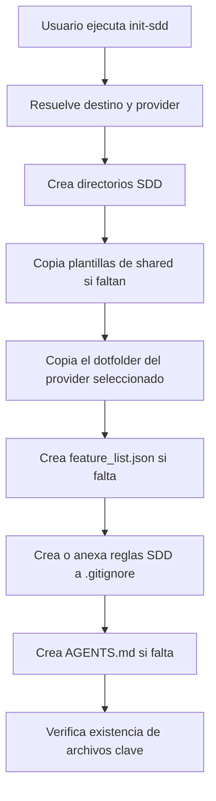
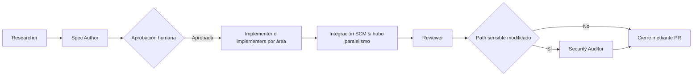

# Arquitectura actual — Stack-Agents

## Alcance y estado

Este repositorio es una plantilla distribuible de **Spec-Driven Development (SDD)**, no una aplicación. No contiene código de producto, API, base de datos, autenticación, infraestructura de despliegue ni suite de pruebas en la raíz. Esta documentación describe únicamente los artefactos presentes al momento de generarla.

## Stack tecnológico

| Área | Tecnología o formato detectado | Uso actual |
|---|---|---|
| Instalación Windows | PowerShell | `init-sdd.ps1` instala la plantilla en un directorio destino. |
| Instalación Unix | Bash | `init-sdd.sh` instala la plantilla en Linux, macOS, Git Bash o WSL según su cabecera. |
| Configuración de agentes | Markdown con YAML front matter, JSON | Instrucciones y definición de agentes/skills para Claude Code, OpenCode y Gemini. |
| Dependencia local de OpenCode | `@opencode-ai/plugin` `1.18.15` | Declarada en `.opencode/package.json`, archivo local ignorado por Git. |
| Node.js raíz | Sin dependencias ni scripts | `package.json` raíz es `{}` y está sin rastrear; no define runner de tests. |
| CI/CD | No configurado | No existe `.github/workflows/` en el estado actual. |

No se detectaron framework de aplicación, ORM, proveedor de base de datos, mecanismos de auth, secretos, variables de entorno, servicios externos ni despliegue.

## Estructura del repositorio

```text
.
├── .claude/                  # Instrucciones, agentes, comandos y skills para Claude Code.
├── .gemini/                  # Instrucciones y skills para Gemini / Antigravity CLI.
├── .opencode/                # Configuración, agentes y skills para OpenCode.
├── architecture/             # Documentación de arquitectura generada (este archivo).
├── research/                 # Hallazgos producidos por el flujo SDD; contiene hallazgos de hardening.
├── scripts/                  # Configuración operacional generada, incluido el mapa de triggers.
├── shared/                   # Plantillas que los instaladores copian al proyecto destino.
├── init-sdd.ps1              # Instalador PowerShell.
├── init-sdd.sh               # Instalador Bash.
└── README.md                 # Uso, estructura y flujo SDD para consumidores de la plantilla.
```

### Directorios distribuibles

- `.claude/`: declara agentes en `agents/`, comandos en `commands/` y contenido de referencia en `skills/`.
- `.opencode/`: `opencode.json` selecciona `leader` como agente predeterminado; `agents/` define los subagentes y `skills/` contiene sus guías. El árbol local incluye `node_modules/` y manifiestos de Node ignorados, que los instaladores actuales pueden copiar por su copia recursiva del directorio.
- `.gemini/`: contiene `GEMINI.md` y las skills equivalentes; su delegación se documenta mediante `define_subagent` e `invoke_subagent`.
- `shared/`: aporta `AGENTS.md`, `feature_list.json` vacío y `progress/current.template.md` cuando faltan en el destino.

## Arquitectura y flujo operativo

El artefacto principal es un instalador de siete etapas, implementado de forma equivalente en PowerShell y Bash:



Los providers admitidos son `all`, `claude`, `opencode` y `gemini`. En PowerShell el parámetro está restringido con `ValidateSet`; el script Bash no aplica una validación equivalente. Con `all`, ambos instaladores copian los tres directorios de provider. Los archivos compartidos se copian solo si no existen; el contenido del dotfolder del provider se copia recursivamente y puede sobrescribir archivos coincidentes.

Tras la instalación, el flujo SDD documentado es:



El modo `quick` omite las fases previas de investigación/especificación y usa Implementer → Reviewer. El modo `full` exige la aprobación humana entre la especificación y la implementación. Los entregables se escriben en disco para evitar transferencia de contexto por chat.

## Configuración y flujos de instalación

### PowerShell

`init-sdd.ps1` acepta `-TargetDir` (por defecto el directorio actual) y `-Provider` (por defecto `all`). Crea `architecture/decisions`, `specs`, `research`, `changes`, `progress`, `reports` y `scripts`; después copia plantillas/configuración y verifica una lista fija de archivos de raíz y provider.

### Bash

`init-sdd.sh` acepta `--target`/`-t`, `--provider`/`-p` y `--help`/`-h`; usa `set -e`. Implementa las mismas etapas declaradas, con copia recursiva de los providers y verificación de presencia posterior.

### Estado de validación

No hay scripts de test ni workflows CI existentes. La verificación de los instaladores comprueba presencia de archivos clave, no contenido, exclusiones de dependencias, árbol completo de cada provider ni compatibilidad entre implementaciones.

## Dependencias

| Dependencia | Versión | Ubicación | Estado de seguimiento |
|---|---:|---|---|
| `@opencode-ai/plugin` | `1.18.15` | `.opencode/package.json` | Archivo local ignorado por `.opencode/.gitignore`. |

No hay dependencias declaradas en el manifiesto de raíz ni lockfile de raíz con paquetes.

## Convenciones detectadas

- Directorios de trabajo SDD: minúsculas y plural cuando corresponde (`specs/`, `research/`, `changes/`, `reports/`, `scripts/`).
- Features: identificador tipo *slug* (`feature-id`); sus artefactos se ubican bajo `specs/<feature>/` y `research/<feature>/`.
- Archivos de configuración: nombres kebab-case (`security-trigger.config.json`, `feature_list.json` como excepción histórica).
- Skills: directorios con snake_case en disco para algunos roles (`architecture_builder`, `security_auditor`, `spec_author`) y nombres con guion en las referencias de rol.
- Entregables de agentes: Markdown; configuraciones de estado y triggers: JSON.

## Dominios sensibles y límites de seguridad

No existen dominios de seguridad de una aplicación (auth, DB, sesiones, API ni secretos). Los dominios sensibles actuales son **operacionales**:

1. **Instaladores** (`init-sdd.ps1`, `init-sdd.sh`): escriben en un destino proporcionado por usuario, copian árboles recursivamente y modifican `.gitignore`.
2. **Configuración de providers y agentes** (`.claude/`, `.opencode/`, `.gemini/`): define la orquestación y las instrucciones que habilitan agentes con capacidades de escritura o ejecución.
3. **Política SDD compartida** (`shared/AGENTS.md`): se propaga a destinos instalados y define gates, roles y condiciones de auditoría.
4. **Mapa de activación de auditorías** (`scripts/security-trigger.config.json`) y su documentación: determinan qué cambios requieren revisión de seguridad.
5. **Reglas de ignore** (`.gitignore` y reglas generadas por los instaladores): afectan la trazabilidad de artefactos operacionales; las reglas generadas actualmente ignoran el propio mapa de triggers.

El archivo `scripts/security-trigger.config.json` refleja estos límites. No se incluyen patrones de imports porque no hay imports de librerías de autenticación, criptografía, base de datos o gestión de secretos detectados.

## Decisiones y ausencias actuales

- No hay ADRs existentes bajo `architecture/decisions/`.
- No se genera CI ni deploy para este repositorio existente: no se detectaron comandos de test, build, lint, aplicación desplegable ni proveedor de hosting sobre los que basar un workflow sin inventar configuración.
