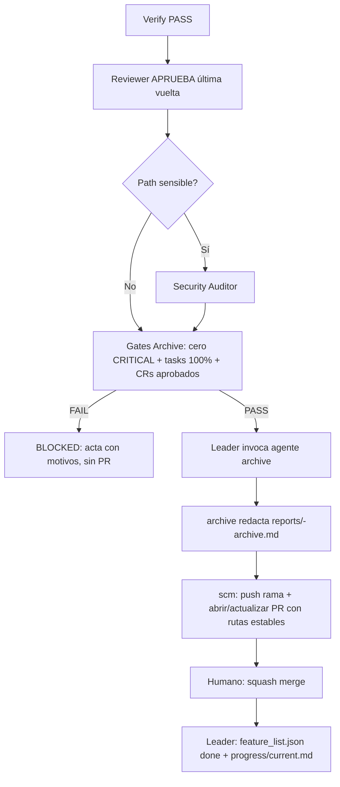

# Design — sdd-archive-phase

Baseline: v2
Feature: sdd-archive-phase

## Componentes afectados

- `reports/<feature>-archive.md` (nuevo): acta de cierre de ciclo; único artefacto que crea Archive. Declara estado AL CIERRE (Final-State Authority), reconcilia baseline v1→vN + CRs + ADRs, y registra verificación y veredicto. Ver plantilla en "Interfaces y contratos".
- `.opencode/agents/archive.md` (nuevo) + `.opencode/skills/archive/SKILL.md` (nueva): subagente dedicado `archive` (Opción C). Único ejecutor de la fase: valida gates, redacta el acta y ejecuta el `diff -r` / movimiento mecánico excepcional. Detalle de permisos y prohibiciones en "Interfaces y contratos".
- `.opencode/AGENTS.md` y `shared/AGENTS.md`: registrar el agente `archive` en la tabla de subagentes e insertar el paso Archive en el pipeline Full entre Security Auditor y Cierre (`... Verify → Reviewer → Security (condicional) → Archive (agente archive, acta) → Cierre PR (scm) + done + current.md`). Aclarar que `archive` no commitea/pushea/mergea ni marca `done`, y que el Leader lo invoca y solo marca `done`/`current.md` tras el merge humano.
- `specs/<feature>/{requirements,design,tasks}.md`: solo lectura durante Archive (para conciliar versión vigente); Archive nunca los edita — toda corrección previa al acta va por CR + Spec Author (baseline v1→v2…→vN).
- `changes/<feature>/`, `reports/<feature>-{review,security}.md` (+ verify-report si existe fase Verify), `architecture/decisions/`, `feature_list.json`, `progress/current.md`: solo lectura para el acta, salvo `feature_list.json`/`current.md` que el Leader actualiza después del merge humano (fuera de Archive).
- `init-sdd.ps1` / `init-sdd.sh`: distribución del nuevo agente + skill solo para el dotfolder opencode (sin tocar `.claude/` ni `.gemini/`).

## Interfaces y contratos

### Acta `reports/<feature>-archive.md` (contrato fijo)

- Input: `specs/<feature>/tasks.md` persistido, baseline vigente (vN por documento), CRs en `changes/<feature>/`, `reports/<feature>-review.md` (+ `-security.md` / verify-report si existen), ADRs, veredictos finales.
- Output: fichero Markdown con estas secciones obligatorias:
  1. `Metadata` — feature, mode (full/quick), baseline vigente por documento, fechas, veredictos Verify/Review/Security.
  2. `Specs Consolidados` — tabla documento | v1 | vN | CRs aplicados.
  3. `Contenidos del ciclo` — inventario de specs, CRs (tipo + estado), reports, ADRs.
  4. `Source of Truth` — declaración "specs/<feature>/ inmutable, sin movimiento" + rutas estables para la PR.
  5. `Reconciliaciones` — stale checkboxes (prueba + motivo) o "ninguna"; partial intencional (faltantes + motivo + aprobación) o "no aplica".
  6. `Verificación` — checklist de gates (cada gate ✅/❌ con evidencia) + bloque `diff -r` verbatim si hubo movimiento excepcional, o "sin movimiento — diff no aplica".
  7. `Veredicto` — `ARCHIVED` | `BLOCKED` (con motivos numerados y accionables) | `PARTIAL-INTENCIONAL`.
- Errores: gates incumplidos → `BLOCKED` (nunca PASS con override en CRITICAL); colisión en movimiento excepcional → `BLOCKED`; artefactos faltantes sin declaración → `BLOCKED`; contradicciones entre fuentes no rankeables → se registran ambas con fechas, nunca se resuelven en silencio.

### Agente `archive` (contrato del ejecutor, Opción C)

- Input: invocación del Leader con el feature-id + rutas de `specs/<feature>/`, `changes/<feature>/`, reports verify/review/security, ADRs y baseline vigente.
- Output: únicamente `reports/<feature>-archive.md` según el contrato del acta. Retorna la ruta del acta y el veredicto; no retorna otros archivos.
- Permisos: lectura sobre todo el repo para conciliar (specs, changes, reports, `architecture/decisions/`, `feature_list.json`, `progress/`) + edición limitada a `reports/**` + tool bash exclusivamente para el `diff -r` obligatorio y, solo con autorización humana explícita documentada, el movimiento mecánico excepcional (`mv` / `git mv` / `cp -R`).
- Prohibiciones: commitear, pushear, abrir/actualizar PR, mergear, marcar `done` o actualizar `progress/current.md`; editar `specs/`, `changes/`, `architecture/` o cualquier archivo fuera de `reports/`; ejecutar composición semántica o `sdd-archive-compose`; auto-resolver colisiones (sufijos, overwrites, renombres silenciosos).
- Errores: cualquier intento fuera de su permiso → STOP con reporte; si el acta resulta BLOCKED, no se avanza al push/PR.

### Gates de Archive (contrato de entrada)

- Input: veredictos Verify/Review/Security + estado de tasks + estado de CRs.
- Output: PASS a redacción de acta `ARCHIVED`/`PARTIAL-INTENCIONAL`, o STOP `BLOCKED` con motivos.
- Errores (todos BLOCKED): Verify FAIL o ausente en full; Review RECHAZA en última vuelta; cualquier CRITICAL pendiente; cualquier `- [ ]` en tasks persistido sin reconciliación probada; cualquier CR Adaptativo/Perfectivo/Preventivo sin aprobación; movimiento con `diff -r` no vacío/faltante; colisión de destino.

### Movimiento excepcional (contrato condicional, solo con autorización humana explícita)

- Input: origen, destino, autorización documentada.
- Procedimiento: shell (`mv` / `git mv` / `cp -R`) ejecutado por el agente `archive` vía tool bash → `diff -r <origen> <destino>` (o equivalente que demuestre identidad) → salida verbatim al acta → `mv` atómico si aplica. Nunca Read→Write del modelo. Nunca `sdd-archive-compose`.
- Errores: sin shell → BLOCKED; diff con diferencias o faltante → BLOCKED/FAIL; destino existente → BLOCKED por colisión (sin sufijos/overwrites); nesting histórico malformado → solo recuperación manual.

## Modelo de datos

Sin entidades nuevas ni migraciones. El acta maneja estas estructuras lógicas:

- **Estado reconciliado**: `{ documento, v1, vN, crsAplicados[], adrsRelacionados[] }` por cada uno de `requirements.md`, `design.md`, `tasks.md`.
- **Gate**: `{ nombre, resultado: PASS|FAIL, evidencia: <ruta reporte + cita> }` para verify, review, security, tasks-100%, crs-aprobados, cero-critical.
- **Reconciliación**: `{ tipo: stale-checkbox|partial-intencional, prueba: <ruta + cita>, motivo, aprobación }`.
- **Veredicto**: `ARCHIVED | BLOCKED | PARTIAL-INTENCIONAL` + `motivos[]`.

Jerarquía Final-State Authority: 1) `specs/<feature>/tasks.md` persistido, 2) hechos finales explícitos del launch prompt, 3) snapshots verify/review/apply-progress. Los números finales salen de la fuente de mayor rango.

## Flujo principal

En Quick no hay `V`; `G` usa gates degradados (RF-08) y el acta lo declara. Archive nunca salta a `P` con veredicto BLOCKED. El Leader orquesta (`L`) pero no redacta el acta; `scm` nunca ejecuta Archive.

## Dependencias

- `.opencode/skills/scm/SKILL.md` (§ Cierre PR): Archive respeta su límite — ni `archive` ni el paso Archive pushean/mergean; la PR sigue con body fijo referenciando `specs/<feature>/` y `reports/` estables.
- `.opencode/skills/spec_author/SKILL.md`: baseline v1 congelada, cambios solo vía CR; Archive solo concilia v1→vN, nunca edita specs.
- `.opencode/skills/reviewer/SKILL.md`: veredicto APRUEBA + flag `architecture_drift` son entradas del acta; drift no bloquea Archive pero queda registrado con su ADR.
- `.opencode/skills/implementer/SKILL.md`: tipos de CR (Corrección avanza sola; demás paran hasta aprobación) determinan el gate de CRs.
- Fase Verify (`sdd-verify-phase`, en curso): su reporte es la evidencia del gate Verify; si la fase aún no existe en un repo, el modo full la exige y su ausencia es BLOCKED.
- `architecture/architecture.md` + `architecture/decisions/`: contexto y ADRs; solo lectura (salvo ADR-001 y su enmienda v2 emitidos por esta spec).
- `feature_list.json` + `progress/current.md`: actualizados por el Leader solo tras merge humano, fuera de Archive.

## ADRs referenciados

- ADR-001 (emitido con la baseline v1, enmendado en v2): *Archive como acta sin movimiento (Opción A)* — ver `architecture/decisions/ADR-001.md`. Fija que `specs/<feature>/` es fuente de verdad inmutable, que no hay main-specs por dominio ni `sdd-archive-compose`, y que el movimiento fechado solo cabe como excepción manual con copia mecánica + `diff -r` + regla de colisión. La enmienda v2 mantiene ese modelo y solo cambia el ejecutor: agente dedicado `archive` (Opción C) en lugar del Leader.

## Respuestas a las 8 preguntas abiertas del research

1. **¿Archive mueve artefactos o solo emite acta? ¿Qué carpeta exacta y con qué prefijo de fecha?** Solo emite acta (Opción A). Ninguna carpeta nueva ni prefijo `YYYY-MM-DD-<id>` por defecto; `specs/<feature>/` queda inmutable. Movimiento solo como excepción humana autorizada, caso por caso, con copia mecánica + `diff -r` y sin carpeta prefijada por esta spec. (Sin cambios v1→v2.)
2. **¿Precondiciones bloqueantes: Verify PASS + Review APRUEBA + cero CRITICAL + tasks 100% + CRs aprobados?** Sí, las cinco, conjuntas y bloqueantes en modo full (RF-01). En Quick, las cuatro sin Verify con declaración de gates degradados (RF-08). (Sin cambios v1→v2.)
3. **¿Reconciliación de stale checkboxes permitida y con qué prueba exacta?** Sí, solo con prueba en el reporte final (verify-report o review-report) que demuestre el trabajo hecho, más motivo registrado en el acta (RF-09). CRITICAL jamás se reconcilia. (Sin cambios v1→v2.)
4. **¿Partial archive intencional permitido y cómo se marca?** Sí, solo declarado como veredicto `PARTIAL-INTENCIONAL` con lista exacta de faltantes, motivo y aprobación humana (RF-09). Sin esa declaración, faltantes = BLOCKED. (Sin cambios v1→v2.)
5. **¿Quién ejecuta Archive y quién marca `done`/`current.md` después?** **El agente dedicado `archive` (Opción C, solo opencode), invocado por el Leader;** `scm` solo pushea y abre/actualiza la PR tras acta PASS/PARTIAL. `done` + `current.md` los marca el Leader únicamente tras el merge humano de la PR (RF-07). (Cambia v1→v2: antes "Archive (Leader, acta)"; ahora "Archive (agente archive, acta)".)
6. **¿Se exige `diff -r` verbatim en el acta para cada copia/movimiento?** Sí, para cada movimiento excepcional autorizado; salida verbatim completa en el acta, vacío = único pass (RF-05, RNF-04). Lo ejecuta el agente `archive` vía bash. Sin movimiento (caso normal) el acta declara "sin movimiento — diff no aplica". (Solo cambia el ejecutor v1→v2.)
7. **¿Cómo se concilian baseline v1→vN, CRs y ADRs pendientes en el acta?** Tabla por documento (v1→vN + CRs aplicados con tipo/estado) + inventario de ADRs + jerarquía de fuentes + registro de contradicciones con ambas fuentes y fechas, sin fusión causal sin evidencia (RF-03). (Sin cambios v1→v2.)
8. **¿Archive en modo Quick (sin Verify) con qué gates degradados?** Review APRUEBA + cero CRITICAL en review + tasks 100% + CRs no-Corrección aprobados, con declaración explícita "Quick: sin verify-report" (RF-08). Nunca se simula un PASS de Verify. (Sin cambios v1→v2.)
