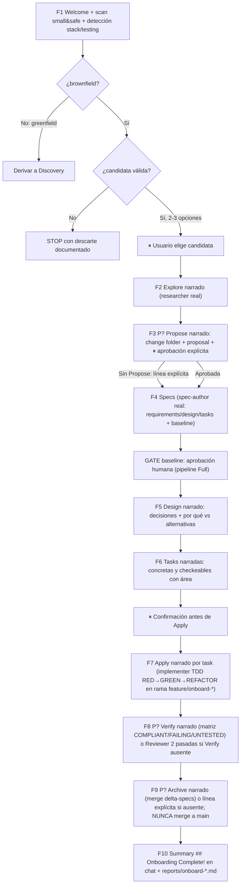

# Design — Flujo SDD Onboard guiado

Baseline: v1
Feature: sdd-onboard-flow

## Componentes afectados

- `.opencode/skills/onboard/SKILL.md` (NUEVO): guion portable de 10 fases, criterios small&safe, template de summary, matriz de parametrización Propose/Verify/Archive, reglas de pausa/idioma/STOP. Es el contrato ejecutable del walkthrough; no otorga permisos por sí mismo.
- `.opencode/agents/onboard.md` (NUEVO, rol coordinador-narrador): front matter `mode: subagent` con permisos SOLO `read *` (sin `edit`, sin `bash`, sin `subagent` amplio). Narra, presenta opciones, pide aprobaciones y le devuelve rutas al Leader. NUNCA escribe artefactos ni código directamente.
- `Leader` (orquestador, SIN cambios de permisos): ejecuta el guion invocando a `onboard` como narrador + a los agentes reales por fase (researcher → spec-author → implementer → reviewer → scm/security-auditor según aplique). Conserva sus permisos actuales (`edit` solo en `feature_list.json`/`progress/**`, `deny edit *`, `allow subagent/bash`). Es el único que puede invocar subagentes.
- Agentes de fase existentes (SIN cambios): `researcher`, `spec-author`, `implementer`, `reviewer`, `security_auditor`, `scm`, `discovery` se reutilizan con sus permisos y formatos vigentes. Onboard no los envuelve ni los suplanta.
- `.opencode/AGENTS.md` + `shared/AGENTS.md` (MODIFICAR): documentar Onboard como "recorrido guiado del modo Full sobre codebase real (brownfield)", tabla de cuándo usar Discovery vs Onboard, y puntero a la skill `onboard`.
- `init-sdd.ps1` + `init-sdd.sh` (MODIFICAR si copian dotfolder por árbol): garantizar que `.opencode/agents/onboard.md` y `.opencode/skills/onboard/SKILL.md` se distribuyan en instalaciones frescas. Sin binarios ni pasos nuevos.
- Artefactos demo efímeros (CREAR solo en rama demo, NUNCA en main de la plantilla): `research/onboard-demo-*/`, `specs/onboard-demo-*/`, `reports/onboard-*.md`, rama `feature/onboard-*` / worktree `wt-onboard-*`. Se desechan al cerrar el walkthrough.

## Decisión de arquitectura de ejecución (responde Q1)

Se adopta la **Opción A — delegación por fase orquestada por el Leader con narrador `onboard` sin privilegios** (hibridación fiel de A + C; se descarta B como ejecución con superset de permisos).

| Opción | Diseño | Veredicto |
|---|---|---|
| A — Delegación por fase | El Leader recorre el pipeline invocando los agentes reales; `onboard` solo narra | **ADOPTADA como ejecución por defecto** — respeta mínimo privilegio, enseña el pipeline real, reutiliza formatos/gates vigentes |
| B — Agente/skill onboard dedicado con permisos amplios | Un `onboard.md` con `edit` en `research/**`+`specs/**`+`src/**`+`tests/**`+`reports/**`+`changes/**` ejecuta todo inline | **RECHAZADA como ejecución** — viola mínimo privilegio, oculta el pipeline real, concentra riesgo de mutación. Solo se toma de B la portabilidad del guion Markdown |
| C — Checklist documentada | Guía estática sin agente | **RECHAZADA como única entrega** — coste mínimo pero sin interactividad/pausas garantizadas. Su contenido vive dentro de la skill `onboard/` como fallback de lectura |
| Inline-Leader puro (variante gentle-ai `delegate_only:false`) | El Leader narra y escribe todo inline | **RECHAZADA** — el Leader tiene `deny edit *` y nunca implementa; violaría `.opencode/AGENTS.md` y el anti-teléfono-descompuesto |

Permisos exactos resultantes (sin cambios a agentes existentes):

- `onboard.md`: `read *` únicamente. Sin `edit`, sin `bash`, sin `subagent`. Si necesita una acción, la pide al Leader, que delega al agente correspondiente.
- `leader.md`: sin cambios (ya puede `subagent`+`bash`, `edit` solo en `feature_list.json`/`progress/**`).
- Fases: cada agente usa exactamente sus permisos declarados (`researcher: edit research/**`, `spec-author: edit specs/** + architecture/decisions/**`, `implementer: edit src/**, tests/**, changes/**`, `reviewer: edit reports/**`, `scm`: branches/worktrees/PR).

## Interfaces y contratos

### Skill `onboard` — entrada/salida

- Input: repo destino ya instalado (carpetas `research/`, `specs/`, `reports/`, `changes/`, `progress/`, `scripts/` presentes); `feature_list.json` con `sdd-onboard-flow` en `in_progress`; repo brownfield (hay código fuente). Si greenfield → derivar a Discovery, no iniciar.
- Output: artefactos demo en rama `feature/onboard-*` + summary en `reports/onboard-<fecha>-<demo>.md` + narración por rutas. Retorna al Leader SOLO rutas (anti-teléfono-descompuesto).
- Errores: sin candidata small&safe → STOP con descarte documentado (RF-02); propuesta de usuario inválida → rechazo + alternativa (RF-03); falta de suite de tests → degradación explícita Apply/Verify (RF-13); paso Propose/Verify/Archive ausente → omisión con línea explícita (RF-09); intento de merge auto o marca done → bloqueado por diseño (RF-07).

### Agente `onboard` (narrador) — contrato

- Input: instrucciones del Leader (fase actual del guion + rutas de artefactos previos).
- Output: texto narrativo 1-3 oraciones + pregunta/opciones cuando el guion exige pausa. NUNCA escribe archivos.
- Errores: si se le pide escribir código/specs, DEBE negarse y pedir delegación al agente de fase.

### Feature demo `onboard-demo-*` — contrato de aislamiento

- Input: candidata aprobada post-proposal.
- Output: findings/specs/código/tests/report bajo prefijo `onboard-demo-*`, siempre dentro de rama `feature/onboard-*`.
- Errores/invariantes: PROHIBIDO registrar en `feature_list.json`; PROHIBIDO merge auto; PROHIBIDO tocar paths sensibles sin opt-in; reversible por borrado de rama.

## Modelo de datos

Sin cambios de esquema. Estados relevantes:

- `feature_list.json`: solo `sdd-onboard-flow` (`mode: full`, `status: in_progress`) es trazada. `onboard-demo-*` nunca aparece (RF-08).
- Rama demo: `feature/onboard-<slug>` / worktree `wt-onboard-<slug>`; PR abierto sin merge (o rama local) como estado final.
- Reporte: `reports/onboard-<YYYY-MM-DD>-<demo-slug>.md` con el template del summary.

## Flujo principal

Guion de 10 fases (adaptación fiel de la referencia gentle-ai a rutas y agentes Stack-Agents). `P?` = parametrizado según exista la fase; `⏸` = pausa obligatoria.

Detalle por fase (qué agente real actúa, qué produce, qué narra `onboard`):

1. **Welcome + scan**: Leader + `onboard` narran; detección stack/testing/skills; scan small&safe con veredicto criterio-por-criterio; presentan 2-3 opciones. ⏸ elección.
2. **Explore narrado**: `researcher` produce `research/onboard-demo-*/findings.md` (5 secciones); `onboard` narra 1-3 oraciones + ruta.
3. **Propose narrado (P?)**: si existe fase Propose, agente/flujo vigente crea change folder + `proposal.md`, muestra Capabilities como contrato; ⏸ aprobación explícita. Si no existe, una línea explícita y se avanza a Specs (el gate Full sigue vigente).
4. **Specs**: `spec-author` produce `specs/onboard-demo-*/{requirements,design,tasks}.md` como delta Given/When/Then testeable.
5. **Design**: se narra desde `design.md` de la demo (decisiones + alternativas descartadas).
6. **Tasks**: se narran tasks concretas/checkeables con su `área`; ⏸ confirmación antes de código.
7. **Apply narrado por task**: `scm` crea rama/worktree; `implementer` ejecuta TDD por task; `onboard` narra por task sin pegar código.
8. **Verify narrado (P?)**: si existe Verify independiente, matriz COMPLIANT/FAILING/UNTESTED; si no, Reviewer 2 pasadas + preflight degradable (máx. 2 vueltas). Sin suite → checklist explícita degradada.
9. **Archive narrado (P?)**: si existe Archive, merge de delta-specs + carpeta `archive/`; si no, línea explícita. En ambos casos: sin merge a `main`, sin marca `done`.
10. **Summary**: template RF-14 en chat + persistencia `reports/onboard-*.md`.

## Parametrización Propose/Verify/Archive (responde Q6)

Matriz de compatibilidad (el guion la implementa como ramas, no como texto aspiracional):

| Estado del pipeline | Propose (F3) | Verify (F8) | Archive (F9) |
|---|---|---|---|
| Fase existe (`sdd-propose/verify/archive-phase` adoptadas) | Ejecutar con formato real + gate | Matriz COMPLIANT/FAILING/UNTESTED | Merge delta-specs + `archive/` |
| Fase ausente (estado actual: las 3 `in_progress`) | Línea explícita "paso aún no adoptado — se omite; el gate Full de baseline sigue vigente" | Reviewer 2 pasadas como verificación | Línea explícita; cierre = rama abierta sin merge + summary |

Regla: el guion NUNCA enseña un paso inexistente como existente. La skill `onboard` referencia las skills/fases por nombre y verifica existencia antes de narrarlas.

## Relación con Discovery y `sdd-init` ausente (responde Q8)

- **Discovery vs Onboard**: Discovery = greenfield (sin código → entrevista por fases → `research/project-brief.md`). Onboard = brownfield (con código → walkthrough haciendo → demo `onboard-demo-*`). Criterio de derivación: si no hay código fuente ni `architecture/architecture.md`, Onboard deriva a Discovery en F1 y termina sin demo. Se documenta la tabla comparativa en AGENTS para evitar sustitución (Discovery como sustituto = no-fit).
- **`sdd-init` ausente**: Onboard no lo implementa, pero F1 incluye su sustituto mínimo: detección de stack/lenguaje, runner de tests, cobertura workspace-wide (para fijar expectativas TDD), y skills aplicables (architecture_builder si falta `architecture.md`, supabase si hay DB, ux-ui si hay UI, deploy si hay hosting). Esto evita el gap "ciclo ciego al stack" sin crear una feature nueva.

## Dependencias

- Internas: `.opencode/agents/{leader,researcher,spec-author,implementer,reviewer,security_auditor,scm,discovery}.md` y sus skills; `.opencode/AGENTS.md`, `shared/AGENTS.md`; `scripts/security-trigger.config.json` (la demo debe evitar sus paths o disparar auditoría con opt-in); `feature_list.json` (solo lectura para la demo); instaladores `init-sdd.ps1`/`.sh`.
- Externas: ninguna nueva. Riesgo controlado: demo que requiera Supabase/deploy/Context7 solo como opt-in según skills detectadas.
- Fases hermanas `in_progress`: `sdd-propose-phase`, `sdd-verify-phase`, `sdd-archive-phase` — Onboard las consume parametrizadas, no las bloquea ni las implementa.

## ADRs referenciados

- N/A — sin ADRs en `architecture/decisions/`. No se emite ADR: la decisión ejecución-delegada (A sobre B) es de diseño de feature y queda registrada en esta baseline; si a futuro se propone un agente con superset de permisos, esa propuesta SÍ requerirá ADR de seguridad.

## Apéndice — Respuestas a las 9 preguntas abiertas del Researcher

1. **¿Ejecución inline (Leader) vs agente `onboard` vs delegación por fase? ¿Con qué `permissions` exactas?** Delegación por fase orquestada por el Leader (Opción A) con narrador `onboard` sin privilegios. `onboard.md`: solo `read *`. Sin `edit`/`bash`/`subagent`. Agentes de fase conservan sus permisos vigentes. Se rechaza ejecución inline con superset (B) y Leader-inline (viola `deny edit *`).
2. **¿La demo se registra en `feature_list.json`? ¿Con qué `id`/`mode` y quién la limpia?** NO se registra. Solo `sdd-onboard-flow` (`full`, `in_progress`) está trazada. La demo vive como `onboard-demo-*` en su rama; la limpia el usuario borrando la rama/worktree (`scm` puede asistir, sin merge). Ningún agente marca `done`.
3. **¿Rama/worktree obligatorios (`feature/onboard-*`, `wt-onboard-*`) y prohibición de merge auto?** Sí, obligatorios antes de cualquier escritura en `src/`/`tests/`, vía `scm`. Merge auto PROHIBIDO por diseño; el estado final es rama abierta/PR sin merge o rama local.
4. **¿Criterios small&safe vinculantes y STOP si no hay candidata?** Sí, vinculantes y medibles (RF-01: 30-60 min, sin breaking/migraciones, valor real, ≥1 req + 2 escenarios, fuera de paths sensibles). Sin candidata → STOP documentado, prohibido forzar (RF-02).
5. **¿Aprobación post-proposal obligatoria y puntos de pausa adicionales?** Sí, aprobación post-proposal obligatoria (gate didáctico) + pausa de elección de candidata + confirmación pre-Apply. Resto sin bloqueos (RF-04, RF-11; el gate de baseline Full se mantiene).
6. **¿Guion parametrizado si Propose/Verify/Archive aún no existen?** Sí — matriz § Parametrización: ejecutar si existen, omitir con línea explícita si no. Nunca enseñar lo inexistente (RF-09).
7. **¿Idioma de artefactos y de narración?** Ambos en español neutro (convención Stack-Agents); términos propios del pipeline en inglés. Se rechaza el contrato inglés-neutro gentle-ai (RNF-03).
8. **¿Relación con Discovery y con `sdd-init` ausente?** Discovery = greenfield, Onboard = brownfield; derivación en F1 si no hay código (§ Relación). Sin `sdd-init`, F1 incluye detección mínima stack/testing/skills; no se crea `sdd-init` aquí (RF-12, RF-13).
9. **¿Summary final con qué template y dónde se guarda?** Template `## Onboarding Complete!` (RF-14: change, artefactos WHY/WHAT/HOW/STEPS, files changed, one-liner, SDD-vs-directo, next steps) mostrado en chat Y persistido en `reports/onboard-<fecha>-<demo>.md` (RF-15).
