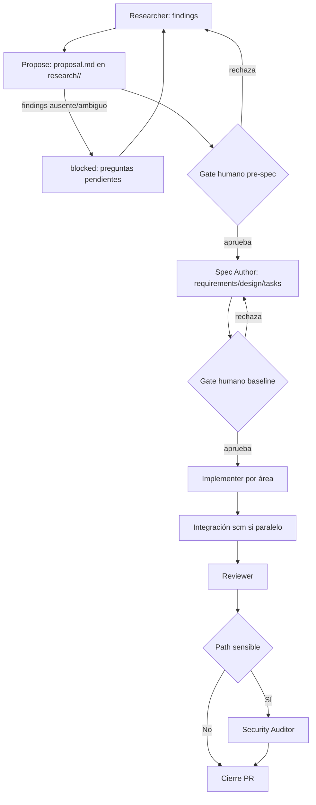

# Design — sdd-propose-phase

Baseline: v1
Feature: sdd-propose-phase

## Componentes afectados

- **Nuevo agente `.opencode/agents/propose.md`** (crea): ejecutor dedicado de la fase, espejo del patrón `researcher.md`/`spec-author.md` (front matter con `mode: subagent` y permisos `read:*` + `edit: research/**`). Se elige agente dedicado (Opción A adaptada, Q6) para no violar la prohibición del Researcher de opinar diseño ni mezclar proposal con baseline dentro del Spec Author.
- **Nueva skill `.opencode/skills/propose/SKILL.md`** (crea): template fijo de 9 secciones, regla `blocked`, guía de concisión, contrato Capabilities, envelope de retorno (solo rutas). Es la única fuente normativa de formato.
- **`.opencode/AGENTS.md` y `shared/AGENTS.md`** (modifican): insertan `Researcher → [Propose + gate liviano] → Spec Author → [Gate baseline]` en el pipeline Full, añaden la fila `propose` a la tabla de subagentes y declaran exención Quick + retorno a Researcher ante rechazo (RF-06, RF-09).
- **`research/<feature>/proposal.md`** (nuevo artefacto canónico, Q1): input previo del Spec Author; vive en `research/` para no contaminar la baseline congelada de `specs/` (que sigue siendo exactamente 3 archivos v1).
- **Orquestación del Leader** (solo documentación en los AGENTS.md, sin código): invoca `propose` tras Researcher, presenta la proposal al gate, bifurca aprobación→Spec Author / rechazo→Researcher.
- **Instaladores `init-sdd.ps1` / `init-sdd.sh`** (verificar, modificar solo si la copia recursiva no cubre los nuevos paths): deben distribuir el nuevo agente + skill dentro del dotfolder `.opencode/` sin nuevos parámetros ni binarios.
- **Spec Author como consumidor** (sin cambio de código, solo contrato): su input pasa a ser findings + proposal aprobada + `architecture.md` + ADRs; debe rechazar proposals malformadas o no aprobadas.

## Interfaces y contratos

### Contrato `research/<feature>/proposal.md` (formato normativo)

- Input: `research/<feature>/<feature>-findings.md` existente y no ambiguo (+ `research/project-brief.md` si aplica, + `architecture/architecture.md` como contexto) y change-name (`<feature>` slug kebab-case).
- Output: `research/<feature>/proposal.md` con secciones fijas en este orden:
  1. `Intent` (1–3 frases: qué y por qué, sin detallar RF).
  2. `Scope — In` (lista de bullets observables).
  3. `Scope — Out` (lista explícita de no-objetivos).
  4. `Capabilities` (tabla `capability | spec file(s) | new/modified/none`; `None` explícito permitido solo con justificación de refactor puro).
  5. `Approach` (pasos de alto nivel, sin código).
  6. `Affected Areas` (tabla `path | impacto`; paths concretos, kebab-case).
  7. `Risks` (tabla `riesgo | probabilidad | mitigación`).
  8. `Rollback Plan` (obligatorio, no vacío).
  9. `Dependencies` (lista; `none` explícito si no hay).
  10. `Success Criteria` (checkboxes verificables, obligatorios).
- Errores: si input ausente/ambiguo → **no escribir** `proposal.md` y retornar `blocked` con `Preguntas pendientes` (Q5). Si ya existía una proposal previa aprobada, leerla y actualizarla en lugar de duplicarla; nunca sobrescribir una aprobada con un `blocked`.

### Contrato Capabilities → spec files (Q5)

- Input: cada fila de `Capabilities`.
- Output: obligación del Spec Author — por cada capability `new/modified` debe crear o actualizar el spec file declarado; `none` solo admite cambios sin baseline nueva (debe justificarse en Approach).
- Errores: capability sin spec file declarado, o spec file creado sin capability que lo respalde → el Spec Author debe devolver la proposal al Leader como malformada (enforcement por convención, RNF-06).

### Envelope de retorno del agente `propose`

- Input: invocación del Leader con `<feature>` + rutas de findings/brief.
- Output: **únicamente rutas en disco** (anti-teléfono-descompuesto): `research/<feature>/proposal.md`, o `blocked: <lista de preguntas>` sin writes. Sin resumen inline del contenido.
- Errores: cualquier intento de escribir fuera de `research/**` está prohibido por permisos.

### Decisión agente vs skill vs paso (Q6 — Opción A adaptada)

- **Descartada Opción B** (fase 0 dentro de spec-author en `specs/<feature>/proposal.md`): mezclaría propuesta con baseline congelable, exigiría al Spec Author permiso de escritura en `research/**` y auto-gatear su propio output.
- **Descartada Opción C** (solo template + checklist del Leader): coste mínimo pero enforcement nulo; la proposal degradaría a convención opcional.
- **Adoptada Opción A adaptada**: `propose.md` (agente, permisos) + `skills/propose/SKILL.md` (norma de formato). Superficie añadida: 2 archivos Markdown solo-opencode; fidelidad máxima al gate y a la separación Researcher (factual) / Propose (opinión con scope) / Spec Author (baseline).

## Modelo de datos

Sin cambios de modelo. `feature_list.json` conserva su schema (`id/title/mode/status/created_at/updated_at`); el estado `pending/in_progress` ya cubre la fase Propose sin campos nuevos (RNF-04). No hay migraciones, entidades ni tablas.

## Flujo principal

Notas: modo Quick (`Implementer → Reviewer`) no toca este flujo (RF-03). El gate G1 es liviano (aprueba/rechaza la proposal, sin exigir métricas); el gate G2 de baseline queda intacto. `B` y el rechazo de G1 vuelven a Researcher, nunca avanzan a spec (RF-02).

## Dependencias

- Internas: `research/<feature>/<feature>-findings.md` (input obligatorio); `architecture/architecture.md` (contexto); `architecture/decisions/` (vacío hoy — Propose no emite ADRs, solo los referencia si existieran); `specs/<feature>/` (consumidor downstream); `.opencode/agents/leader.md` (orquestación, sin edición directa de entregables).
- Externas: ninguna nueva. `gh` CLI sigue siendo solo fallback de `scm`; sin MCP, sin red, sin binarios en runtime.
- Distribución: instaladores copian el dotfolder `.opencode/` recursivamente; si la copia ya incluye los nuevos paths no se requiere cambio de código en instaladores (verificar en tasks).

## ADRs referenciados

- N/A — `architecture/decisions/` está vacío (verificado en findings §5 y `architecture.md` § "Decisiones y ausencias actuales"); no hay ADR previo que restrinja el approach.
- Decisión arquitectónica significativa tomada en este diseño (no se emite ADR separado porque la baseline de specs es su registro y no hay árbol de ADRs que extender; queda trazada aquí): **Opción A adaptada + ubicación `research/<feature>/proposal.md` + gate bloqueante humano + obligatoriedad Full/exención Quick + concisión SHOULD + `blocked` y Capabilities vinculantes**. Alternativas descartadas: Opción B (mezcla proposal/baseline), Opción C (sin enforcement), ubicación `specs/<feature>/proposal.md` (contamina baseline), gate consultivo o auto-aprobación del Leader (anula el filtrado temprano), obligatoriedad intra-Full opt-in (ambigüedad), límite <450 palabras como MUST con validador (no portable sin binario), modos `engram/openspec/hybrid` (no-fit portable). Consecuencias: +2 archivos Markdown solo-opencode a mantener; doble gate solo en Full (Quick como escape); enforcement por convención + humano.
