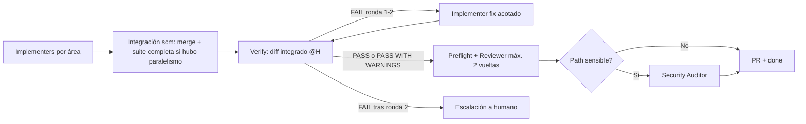

# Design — sdd-verify-phase

Baseline: v1
Feature: sdd-verify-phase

## Componentes afectados

- `.opencode/agents/verify.md` (nuevo): subagente dedicado solo-opencode, permisos `read "*"` + `edit "reports/**"` + `bash "*"`. No edita código. Retorna solo la ruta del reporte.
- `.opencode/skills/verify/SKILL.md` (nuevo) + `references/report-format.md` (nuevo): guía operativa Verify (orden specs→design→tasks, matriz compliance, política de ejecución única, matriz de degradación, severidades y veredictos). Adaptación sin binario ni MCP de la referencia gentle-ai sdd-verify v3.0.
- `reports/<feature>-verify.md` (nuevo artefacto por feature): único output de Verify, consumido por Reviewer y citado en el body de la PR.
- `.opencode/AGENTS.md` y `shared/AGENTS.md` (modificar): orden Full + presupuestos de vueltas + tabla Verify vs Reviewer; Quick Mode sin cambios (sin Verify).
- `init-sdd.ps1` / `init-sdd.sh` (modificar): incluir `.opencode/agents/verify.md` y `.opencode/skills/verify/` en la copia del provider `opencode`/`all` y en la verificación de archivos clave.
- `specs/sdd-verify-phase/` (esta baseline): requirements/design/tasks v1 pendientes de aprobación humana.
- No tocados: `.opencode/agents/reviewer.md`, `.opencode/skills/reviewer/SKILL.md` (solo consumen el reporte), `.opencode/skills/scm/`, `.opencode/skills/security_auditor/`, `.claude/`, `.gemini/`, `feature_list.json` (schema intacto).

## Interfaces y contratos

### Entrada que el Leader entrega a Verify

- Input: diff integrado de la rama `feature/<feature-id>` (post-`scm`, commit hash H), `specs/<feature>/requirements.md`, `design.md`, `tasks.md`, `changes/<feature>/**/CR-NNN.md`, `reports/<feature>-preflight.md` (opcional), evidencia de suite de integración `scm` (commit hash + exit codes, si hubo paralelismo), `architecture/architecture.md` (solo contexto, sin autoridad de drift).
- Output: ruta `reports/<feature>-verify.md` con veredicto único.
- Errores: tasks pendientes → `FAIL` + `blocked` sin suite completa; sin `requirements.md` → `FAIL` + `blocked`; artefactos parciales → dimensiones `SKIPPED` según matriz de degradación; runner inexistente → runtime `SKIPPED` + `WARNING`.

### Reporte `reports/<feature>-verify.md` (formato obligatorio, Markdown)

Secciones fijas en este orden:

```markdown
# Verification Report — <feature-name>

## Metadata
feature: <feature-id> | commit: <hash H> | baseline: v<n> | resultado_scm: <pass/no-aplica> | preflight: <presente/ausente>

## Completeness (tasks + CRs)
| Task | Área | Estado | Evidencia |
|---|---|---|---|
CRs considerados: <lista o "ninguno"> — estado global: <complete | blocked>

## Evidencia de runtime
| Comando | Exit code | Hash salida | Alcance |
|---|---|---|---|
<npm test / dotnet test / build / type-check / covering tests puntuales; "reusado de scm/preflight @<hash>" cuando aplique>

## Matriz spec (requisito/escenario → evidencia + test)
| RF/AC | Escenario | Covering test | Resultado runtime | Estado |
|---|---|---|---|---|
Estado por fila: COVERED | UNTESTED | FAILING

## Coherencia con design
| Elemento design | Diff | Estado |
Estado por fila: ALIGNED | DEVIATION (warning) | BREAKING (critical)

## Issues
### CRITICAL
### WARNING
### SUGGESTION
(cada issue: archivo:línea, requisito roto o diseño desviado, fix sugerido sin aplicarlo, test faltante)

## Veredicto
PASS | PASS WITH WARNINGS | FAIL (+ `blocked` cuando aplique por tasks pendientes)

## Trazabilidad de decisiones
<respuestas Q1–Q8 con RF que las implementa>
```

Campos obligatorios por ejecución de comando: comando exacto, exit code, hash de salida (texto documentado), alcance (suite completa vs covering puntual vs reusado). Sin fence YAML inicial. Variante JSON mínimo (small-model) explícitamente rechazada: un solo formato Markdown para mantener enforcement por convención.

### Qué cuenta como covering test

Test automatizado del proyecto destino que (a) mapea 1:1 a un RF/AC/escenario, (b) se ejecutó en runtime en esta ronda Verify (o reusado con mismo commit hash H documentado), (c) terminó con exit code 0. Análisis estático, lectura de código o preflight ausente nunca cuentan como covering. Revisión manual documentada solo es aceptable en la rama degradada "sin runner" (→ `WARNING`, nunca `COVERED`).

## Modelo de datos

Sin entidades nuevas. Estados cerrados:

- Hallazgo: `CRITICAL | WARNING | SUGGESTION`. `CRITICAL` = RF/AC incumplido, covering test ausente con runner disponible (`UNTESTED`), covering test fallido (`FAILING`), test suite exit≠0, tasks pendientes, desviación que rompe spec.
- Fila spec: `COVERED | UNTESTED | FAILING`. Fila design: `ALIGNED | DEVIATION | BREAKING`. Dimensión degradada: `SKIPPED + motivo`.
- Veredicto: `PASS` (0 CRITICAL, 0 WARNING) | `PASS WITH WARNINGS` (0 CRITICAL, ≥1 WARNING) | `FAIL` (≥1 CRITICAL o blocked).
- Contadores independientes: `verify_round` (1–2) ≠ `reviewer_round` (1–2) ≠ contador de CRs.

## Flujo principal

Orden en pipeline Full (único orden válido):



Pasos internos de Verify (orden fijo specs→design→tasks→runtime→reporte):

1. Contar tasks: si hay pendientes → `FAIL` + `blocked`, terminar sin suite completa.
2. Mapear requisito/escenario → evidencia + covering test (matriz spec).
3. Chequear design vs diff (matriz coherencia).
4. Resolver evidencia runtime por política de ejecución única (ver Dependencias), ejecutar solo lo faltante, registrar comandos/exit codes/hashes.
5. Clasificar issues, computar veredicto, persistir `reports/<feature>-verify.md`, retornar solo la ruta. Nunca fija código, nunca inicia Judgment Day/RDD/refuter, nunca abre PR.

## Relación con preflight y review

- **Con preflight**: Verify lo consume como evidencia (métricas y resultados) y cita `commit hash`; si el hash coincide con H, reusa la suite completa y solo corre covering tests faltantes. Verify no exige preflight ni lo reemplaza.
- **Sin preflight**: Verify lo documenta (`preflight: ausente — ejecución mínima propia`) y corre los checks del RF-05. No penaliza por la ausencia en sí.
- **Con Reviewer**: Reviewer P1 consume `reports/<feature>-verify.md` como evidencia autoritativa de conformidad funcional. Delimitación anti-solape:

| Dimensión | Verify (autoridad) | Reviewer (autoridad) |
|---|---|---|
| Tasks completadas | ✅ decide PASS/FAIL blocked | Lee el veredicto, no re-decide salvo contradicción concreta |
| RF/escenario → covering test pasado | ✅ matriz spec + veredicto | P1 verifica lectura, solo re-abre con motivo concreto (test mal mapeado) |
| Coherencia design | ✅ WARNING salvo rotura spec | No duplica; solo P2 evalúa implicancias de calidad |
| CRAP/mutation/naming/duplicación | ❌ no evalúa | ✅ P2 exclusivo |
| ADRs/drift (`architecture_drift`) | ❌ no emite ADR ni flag | ✅ P2 exclusivo |
| Seguridad/RLS/secretos | ❌ excluido | ❌ (Security Auditor) |
| Veredicto final APRUEBA/RECHAZA | ❌ no lo emite | ✅ exclusivo del Reviewer |

- **Con Security Auditor y cierre `scm`**: sin cambios. El body de la PR cita además `reports/<feature>-verify.md` junto a review/security. Quick Mode (`Implementer → Reviewer`) no incluye Verify.

## Presupuesto de vueltas y regla anti-loop

- Presupuesto Verify: máx. **2 rondas** (`verify_round: 1 | 2`), independiente de `reviewer_round` y de CRs. `FAIL` ronda 1 → 1 vuelta acotada a Implementer (solo hallazgos CRITICAL). `FAIL` ronda 2 → escalación a humano, sin tercera ronda automática.
- Anti-loop: (a) Verify nunca edita código ni reintenta por sí mismo; (b) Verify nunca inicia Judgment Day/RDD/refuter/corrección; (c) una contradicción irresoluble spec-vs-design-vs-diff = `FAIL` + escalación, no nuevo ciclo; (d) una ronda Verify→Verify sin cambio de diff (mismo hash H) está prohibida — el Leader la rechaza.
- Doble ejecución controlada por política de ejecución única: `scm` corre la suite completa post-merge; Verify la reusa si `H` coincide; Reviewer no re-corre salvo mismatch documentado. El riesgo residual de doble ejecución (observado en findings §3) se acepta solo para covering tests puntuales faltantes.

## Matriz de degradación (artefactos faltantes / sin runner)

| Condición | Dimensiones afectadas | Registro | Efecto en veredicto |
|---|---|---|---|
| Tasks pendientes | completeness | `blocked`, tabla con pendientes | `FAIL` directo, sin suite |
| Sin `requirements.md` | toda la matriz spec | `blocked: nada que verificar` | `FAIL` directo |
| Sin `design.md` | coherencia-design | `SKIPPED + WARNING` (motivo: sin diseño) | No bloquea por sí solo |
| Solo tasks (sin specs/design) | solo completitud | matrices spec/design `SKIPPED` | `FAIL` solo si hay pendientes |
| Sin runner detectable | runtime | `SKIPPED + WARNING` + checklist manual documentado | Nunca `CRITICAL` por falta de runner; filas spec quedan `UNTESTED` pero severidad degradada a `WARNING` |
| Con runner, escenario sin covering pasado | matriz spec | `UNTESTED`/`FAILING` | `CRITICAL` → `FAIL` |
| Preflight ausente | evidencia | `preflight: ausente` | Sin penalización |
| `workspace-planning` (sin equivalente local) | n/a | `FAIL` + `blocked: fuera de feature con baseline` | No verificado |

## Dependencias

- Reusa convención de runners del proyecto destino (`npm test` / `dotnet test` / equivalente, build, type-check); hoy se resuelven por convención del repo destino (futuro `sdd-init` los detectará). Ninguna dependencia nueva.
- Ejecución única: fuente de verdad de la suite completa = integración `scm` (si hubo paralelismo) o preflight (si existe y el hash coincide). Verify ejecuta suite completa solo si no hay evidencia fresca sobre H; en otro caso solo covering tests puntuales.
- Referencias observadas: gentle-ai `sdd-verify` v3.0 (adaptada: gate independiente, orden specs→design→tasks, evidencia runtime, severidades, tasks pendientes → blocked) y `judgment-day` v1.7 (explícitamente posterior y fuera de Verify). Validador binario, Engram/hybrid/none, fence YAML y conteo nativo = no-fit, no se adoptan.

## Decisiones sobre las 8 preguntas abiertas (trazabilidad)

- **Q1 ¿Bloqueante o informativo?** → Bloqueante parcial: `FAIL`→vuelta a Implementer; `PASS WITH WARNINGS`→avanza a Reviewer. Implementan RF-09 + RF-08.
- **Q2 ¿Presupuesto propio y anti-loop?** → Sí: máx. 2 rondas Verify independientes + regla anti-loop en 4 cláusulas. Implementa RF-10.
- **Q3 ¿Formato de reporte?** → Markdown completo obligatorio `reports/<feature>-verify.md` con 7 secciones y campos comando/exit/hash; JSON mínimo rechazado. Implementan RF-05 + sección Interfaces.
- **Q4 ¿Degradación exacta?** → Matriz de 8 filas (sin requirements → FAIL; sin design/runner → SKIPPED+WARNING). Implementa RF-13.
- **Q5 ¿Quién ejecuta la suite completa?** → `scm` post-merge es fuente de verdad; Verify reusa si el hash coincide y solo corre covering faltantes. Implementan RF-01 + RNF-06.
- **Q6 ¿Relación con preflight?** → Coexiste: Verify lo consume si existe, nunca lo reemplaza ni lo exige. Implementa RF-12.
- **Q7 ¿Escenario sin covering = CRITICAL?** → Sí cuando hay runner (`CRITICAL UNTESTED/FAILING` → FAIL); degradado a `WARNING` + checklist manual solo cuando no hay runner. Implementan RF-03 + RF-07 + RF-13.
- **Q8 ¿Agente nuevo vs extensión reviewer?** → Opción A: `.opencode/agents/verify.md` + `.opencode/skills/verify/` nuevos, pre-Reviewer, solo-opencode. Opciones B (extensión Reviewer) y C (checklist sin agente) rechazadas por mantener acoplamiento funcional+calidad (B) y por enforcement solo por convención (C). Implementa RF-14.

## ADRs referenciados

- Sin ADRs existentes en `architecture/decisions/` (constatado en findings §5). Esta feature no emite ADR: adopta la Opción A dentro del margen del pipeline sin contradecir decisiones previas.
