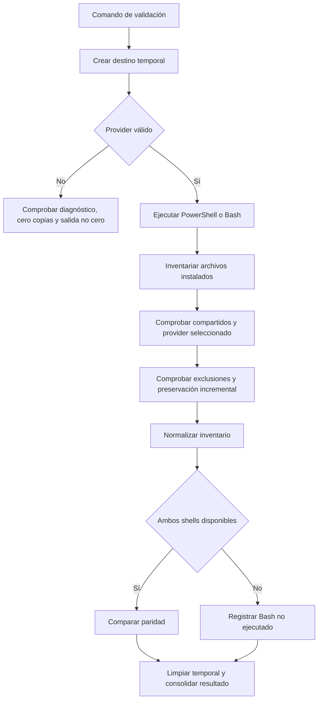

# Design — template-hardening

Baseline: v1
Feature: template-hardening

## Componentes afectados

- `init-sdd.ps1`: reemplazar la copia indiscriminada del provider por una copia con exclusiones, conservar archivos ocultos distribuibles, centralizar el inventario de selección/verificación y devolver códigos de salida consistentes.
- `init-sdd.sh`: aplicar el mismo contrato de provider, copia y verificación que PowerShell; validar el provider antes de crear o copiar contenido dependiente del provider.
- `tests/template-hardening/` y archivos mínimos de ejecución en la raíz: incorporar un harness basado en el runner nativo de Node.js que cree destinos temporales, ejecute los instaladores y compruebe sus contratos observables. Los casos de PowerShell y Bash se separan por archivo para evitar colisiones de trabajo.
- `.gitignore`: ignorar dependencias locales de raíz sin ocultar manifiestos/lockfiles versionados de la automatización.
- Bloque SDD embebido en ambos instaladores: retirar exclusivamente `scripts/security-trigger.config.json` de las reglas que se crean o anexan en un destino.
- `.claude/commands/security-audit.md`, `.claude/skills/security_auditor/SKILL.md`, `.opencode/skills/security_auditor/SKILL.md` y `.gemini/skills/security_auditor/SKILL.md`: unificar la ruta del reporte de auditoría.

## Interfaces y contratos

### Contrato de selección de provider
- Input: `-Provider` en PowerShell y `--provider`/`-p` en Bash.
- Valores válidos: `all`, `claude`, `opencode`, `gemini`; la ausencia del argumento equivale a `all`.
- Output: una lista ordenada de dotfolders: `all` → `.claude`, `.opencode`, `.gemini`; un proveedor individual → solo su dotfolder.
- Errores: un valor fuera del conjunto permitido debe producir diagnóstico y código de salida no cero antes de copiar providers. PowerShell conserva su validación declarativa; Bash incorpora una validación equivalente.

### Contrato de copia distribuible de provider
- Input: árbol fuente de `.claude`, `.opencode` o `.gemini` y directorio de destino.
- Output: unión recursiva del contenido distribuible de la fuente en el destino, sobrescribiendo únicamente coincidencias distribuibles, e incluyendo dotfiles distribuibles.
- Exclusiones: en cualquier nivel del árbol fuente se excluyen `node_modules/`, `package.json`, `package-lock.json`, `bun.lock` y `.gitignore`. La operación no borra ni toca instancias preexistentes de esos nombres en el destino.
- Errores: fuente de provider ausente o error de copia debe hacer fallar el instalador; el resultado no puede anunciar éxito.

### Contrato de verificación del instalador
- Input: destino y selección válida de provider.
- Output: diagnóstico por cada artefacto compartido y archivo principal requerido del provider, y código cero solo si todos existen y si no se detectan artefactos excluidos copiados por la operación.
- Errores: faltantes, provider inválido o incumplimiento de exclusión devuelven código no cero.

### Contrato de validación automatizada
- Input: comando versionado de prueba y rutas al repositorio e intérpretes disponibles.
- Output: casos independientes en directorios temporales, resultados con nombre de caso y fallo no cero si falla cualquier aserción.
- Cobertura mínima: selección válida e inválida, `all`, destino con espacios, destino preexistente/incremental, inventario distribuible, exclusiones, código de salida y paridad normalizada entre instaladores.
- Errores: la ausencia de Bash marca sus casos como no ejecutables con razón explícita; no se contabiliza como caso aprobado de paridad.

### Contrato de reporte de Security Auditor
- Input: feature auditada.
- Output canónico: `reports/<feature>-security.md`.
- Errores: cualquier documentación distribuible que anuncie `reports/<feature>-security-audit.md` incumple el contrato y debe ser detectada por la validación documental.

## Modelo de datos

No se introducen entidades ni persistencia. La automatización manejará estructuras efímeras de prueba:

- **Caso de instalación**: `{ instalador, provider, destino, resultadoEsperado }`.
- **Inventario normalizado**: rutas relativas de archivos y directorios bajo cada provider, filtradas con las exclusiones del contrato y ordenadas léxicamente para comparar PowerShell con Bash sin depender de separadores de ruta.
- **Artefacto prohibido**: nombre/ruta de la lista de exclusión y su presencia observada en el destino.

## Flujo principal

Los instaladores mantienen sus siete etapas. En la etapa de provider se resuelve primero la selección válida y luego se copia el inventario distribuible. La etapa de `.gitignore` conserva el marcador `SDD Workflow` para idempotencia, pero el bloque ya no ignora el mapa de triggers, que debe ser trazable.

## Dependencias

- `node:test` y APIs estándar de Node.js: harness de pruebas sin dependencias npm externas.
- PowerShell: ejecución y verificación de `init-sdd.ps1`.
- Bash: ejecución y verificación de `init-sdd.sh` en plataformas soportadas.
- `architecture/architecture.md`: contexto operativo y límites sensibles existentes; solo lectura.
- `scripts/security-trigger.config.json`: mapa existente que clasifica instaladores, `.gitignore` y documentos de auditoría como paths sensibles; solo lectura.

## ADRs referenciados

- No aplica. No existen ADRs bajo `architecture/decisions/` y este diseño no introduce una decisión arquitectónica que requiera ADR.
